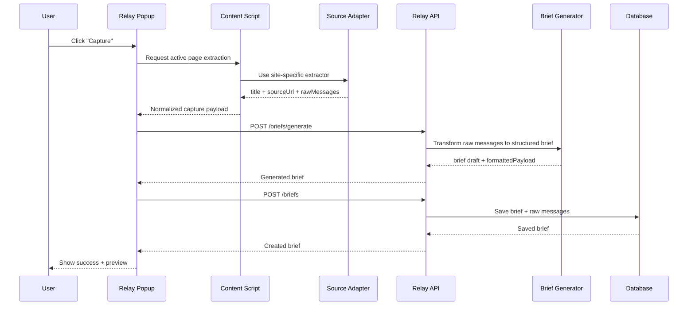

# Relay HLD: Capture Flow

## Capture Sequence

## Source Adapter Responsibilities

- detect whether the current site is supported
- identify the active thread
- extract messages
- extract title and source URL
- normalize messages to internal format

## Initial Source Targets

- ChatGPT
- Claude
