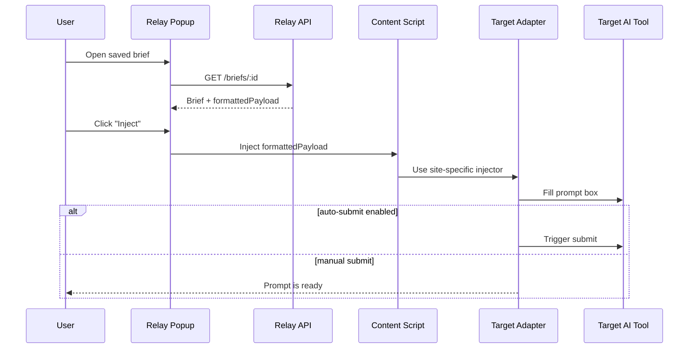

# Relay HLD: Injection Flow

## Injection Sequence

## Target Adapter Responsibilities

- detect prompt input
- insert formatted brief text
- optionally submit
- surface failure when site behavior changes

## Initial Target Sites

- ChatGPT
- Claude
- Gemini

## Fallback

If a target site is unsupported or injection fails:
- copy the formatted payload to clipboard
- prompt the user to paste it manually
