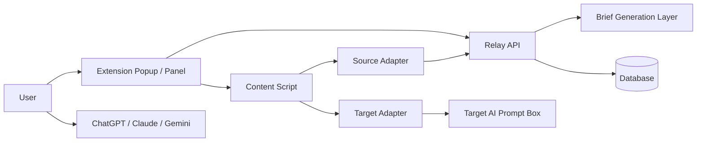
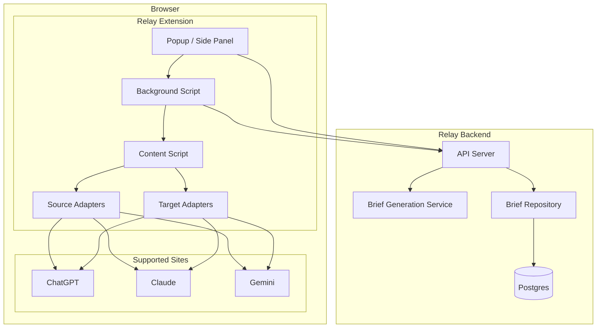
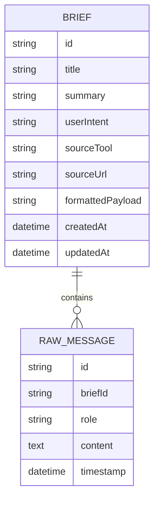

# Relay HLD: System Overview

## 1. System Overview

Relay is a browser-extension-first context bridge for AI tools.

It captures conversation state from a supported source tool, converts that state into a structured `brief`, stores it through the Relay API, and later injects the brief into a supported target tool.

## 2. Core Components

## 3. Main Responsibility Split

### Extension
- Detect current site
- Extract visible conversation messages
- Send capture payload to Relay API
- List saved briefs
- Preview injection payload
- Inject brief into supported target tool

### Relay API
- Validate capture payload
- Generate structured brief
- Save brief
- List briefs
- Fetch brief by id

### Database
- Persist briefs
- Persist raw extracted messages
- Later persist users, sessions, settings, and adapter metadata

## 4. High-Level Design

## 5. API Surface

### Current APIs

- `GET /health`
- `POST /briefs/generate`
- `POST /briefs`
- `GET /briefs`
- `GET /briefs/:id`

### Near-Term APIs

- `PATCH /briefs/:id`
- `DELETE /briefs/:id`
- `POST /captures/preview`
- `POST /inject/preview`

## 6. Data Model

## 7. What Is Real vs Planned

### Implemented now
- monorepo scaffold
- shared brief schema
- API scaffold
- popup shell
- supported-site detection
- Postman collection

### Not implemented yet
- real DOM extraction
- real injection
- persistent DB
- auth
- web library UI
